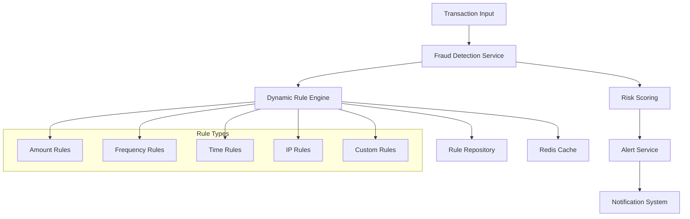

# Real-Time Fraud Detection Service

A high-performance, real-time fraud detection system built with Java Spring Boot, featuring a **dynamic rule engine** that allows rule management without code changes.

## 🚀 Key Features

### Dynamic Rule Engine
- **Zero-Code Rule Management**: Add, modify, or delete fraud detection rules without code changes
- **Real-Time Configuration**: Rules take effect immediately without service restart
- **Multiple Rule Types**: Support for amount, frequency, time-based, IP, and custom rules
- **Configurable Risk Scoring**: Flexible risk weight and priority management

### High Performance
- **Real-Time Processing**: Sub-millisecond fraud detection
- **Scalable Architecture**: Horizontal scaling with Kubernetes
- **Redis Caching**: High-speed state management and rule caching
- **Async Processing**: Non-blocking fraud detection pipeline

### Production Ready
- **Comprehensive Testing**: Unit, integration, and resilience tests
- **Monitoring & Metrics**: Prometheus metrics and health checks
- **Security**: JWT authentication and API token validation
- **Cloud Native**: Kubernetes deployment with auto-scaling

## 🏗️ Architecture



## 🔧 Dynamic Rule System

### Supported Rule Types

| Rule Type | Description | Configuration |
|-----------|-------------|---------------|
| `AMOUNT` | Transaction amount thresholds | `thresholdValue`: Maximum allowed amount |
| `FREQUENCY` | Transaction frequency limits | `thresholdValue`: Max transactions per hour |
| `TIME_OF_DAY` | Time-based restrictions | Suspicious hours: 22:00-06:00 |
| `IP_BLACKLIST` | IP address filtering | Configurable blacklist |
| `CUSTOM` | Complex business rules | JSON configuration support |

### Rule Management APIs

#### Quick Rule Creation
```bash
# Create amount threshold rule
curl -X POST http://localhost:8080/api/v1/fraud-rules/quick-create \
  -d "ruleType=AMOUNT&ruleName=HIGH_VALUE_RULE&threshold=25000&description=Detect high value transactions"

# Create frequency rule
curl -X POST http://localhost:8080/api/v1/fraud-rules/quick-create \
  -d "ruleType=FREQUENCY&ruleName=BURST_DETECTION&threshold=10&description=Detect transaction bursts"
```

#### Advanced Rule Creation
```bash
curl -X POST http://localhost:8080/api/v1/fraud-rules \
  -H "Content-Type: application/json" \
  -d '{
    "ruleName": "WEEKEND_HIGH_AMOUNT",
    "ruleType": "CUSTOM",
    "description": "Weekend high amount detection",
    "thresholdValue": 20000,
    "riskWeight": 0.4,
    "priority": 2,
    "enabled": true,
    "ruleConfig": "{\"timePattern\": \"weekend\", \"multiplier\": 1.5}"
  }'
```

#### Rule Management
```bash
# List all rules
curl http://localhost:8080/api/v1/fraud-rules

# Get specific rule
curl http://localhost:8080/api/v1/fraud-rules/1

# Toggle rule status
curl -X PATCH http://localhost:8080/api/v1/fraud-rules/1/toggle

# Update rule
curl -X PUT http://localhost:8080/api/v1/fraud-rules/1 \
  -H "Content-Type: application/json" \
  -d '{...}'

# Delete rule
curl -X DELETE http://localhost:8080/api/v1/fraud-rules/1
```

## 🚀 Quick Start

### Prerequisites
- Java 17+
- Maven 3.6+
- MySQL 8.0+
- Redis 6.0+
- Kafka 2.8+ (optional)

### Local Development

1. **Clone Repository**
```bash
git clone <repository-url>
cd fraud-service
```

2. **Setup Database**
```bash
# Start MySQL and create database
mysql -u root -p
CREATE DATABASE frauddb;
CREATE USER 'frauduser'@'localhost' IDENTIFIED BY 'password';
GRANT ALL PRIVILEGES ON frauddb.* TO 'frauduser'@'localhost';
```

3. **Start Dependencies**
```bash
# Redis
docker run -d -p 6379:6379 redis:alpine

# Kafka (optional)
docker run -d -p 9092:9092 --name kafka \
  -e KAFKA_BROKER_ID=1 \
  -e KAFKA_LISTENERS=PLAINTEXT://:9092 \
  -e KAFKA_ADVERTISED_LISTENERS=PLAINTEXT://localhost:9092 \
  -e KAFKA_ZOOKEEPER_CONNECT=zookeeper:2181 \
  confluentinc/cp-kafka:latest
```

4. **Run Application**
```bash
mvn spring-boot:run
```

5. **Test Fraud Detection**
```bash
# Test transaction analysis
curl -X POST http://localhost:8080/api/v1/fraud-detection/analyze \
  -H "Content-Type: application/json" \
  -d '{
    "transactionId": "TXN_001",
    "userId": "USER_123",
    "amount": 15000,
    "currency": "USD",
    "ipAddress": "192.168.1.100",
    "timestamp": "2024-01-15T14:30:00"
  }'
```

## 🐳 Docker Deployment

### Build Image
```bash
docker build -t fraud-detection-service .
```

### Run with Docker Compose
```bash
docker-compose up -d
```

## ☸️ Kubernetes Deployment

### Deploy to Kubernetes
```bash
# Apply all manifests
kubectl apply -f k8s/

# Or use all-in-one
kubectl apply -f k8s/all-in-one.yaml
```

### Cloud Platform Specific

#### AWS EKS
```bash
# Create EKS cluster
eksctl create cluster --name fraud-detection --region us-west-2

# Deploy application
kubectl apply -f k8s/
```

#### Google GKE
```bash
# Create GKE cluster
gcloud container clusters create fraud-detection \
  --zone us-central1-a \
  --num-nodes 3

# Deploy application
kubectl apply -f k8s/
```

#### Alibaba ACK
```bash
# Create ACK cluster via console or CLI
# Deploy application
kubectl apply -f k8s/
```

## 📊 Configuration

### Application Configuration

Key configuration options in `application.yml`:

```yaml
fraud:
  detection:
    enabled: true
    fraud-threshold: 0.3  # Risk score threshold for fraud classification
    async-processing: true
    thread-pool-size: 10
  
  rules:
    refresh-interval: 300  # Rule cache refresh interval (seconds)
    cache-enabled: true
    cache-ttl: 600
  
  alerts:
    webhook:
      enabled: true
      url: http://localhost:8080/webhook/fraud-alert
```

### Environment Variables

| Variable | Description | Default |
|----------|-------------|---------|
| `DB_HOST` | Database host | `localhost` |
| `DB_PORT` | Database port | `3306` |
| `DB_NAME` | Database name | `frauddb` |
| `REDIS_HOST` | Redis host | `localhost` |
| `KAFKA_BOOTSTRAP_SERVERS` | Kafka servers | `localhost:9092` |
| `FRAUD_THRESHOLD` | Risk threshold | `0.3` |

## 🧪 Testing

### Run Tests
```bash
# Unit tests
mvn test

# Integration tests
mvn test -Dtest=**/*IntegrationTest

# Test coverage report
mvn jacoco:report
```

### Test Coverage
The project maintains comprehensive test coverage:
- **Unit Tests**: Service layer, rule engine, controllers
- **Integration Tests**: End-to-end API testing
- **Resilience Tests**: Load testing, failure scenarios

### Demo Script
```bash
# Run the demo script to see dynamic rules in action
chmod +x demo-dynamic-rules.sh
./demo-dynamic-rules.sh
```

## 📈 Monitoring

### Health Checks
```bash
# Application health
curl http://localhost:8080/actuator/health

# Detailed health information
curl http://localhost:8080/actuator/health/details
```

### Metrics
```bash
# Prometheus metrics
curl http://localhost:8080/actuator/prometheus

# Custom fraud detection metrics
curl http://localhost:8080/actuator/metrics/fraud.detection.processing.time
```

### Logging
Structured logging with configurable levels:
```yaml
logging:
  level:
    com.faud.frauddetection: INFO
  pattern:
    console: "%d{yyyy-MM-dd HH:mm:ss} [%thread] %-5level %logger{36} - %msg%n"
```

## 🔒 Security

### Authentication
- **JWT Authentication**: Secure API access
- **API Token Authentication**: Internal service communication
- **Role-based Access**: Different access levels

### Security Headers
- CORS configuration
- CSRF protection
- Security headers (X-Frame-Options, etc.)

## 🚀 Performance Optimization

### Caching Strategy
- **Rule Caching**: Redis-based rule caching with TTL
- **State Management**: User transaction state in Redis
- **Query Optimization**: Indexed database queries

### Scaling
- **Horizontal Scaling**: Stateless application design
- **Auto Scaling**: Kubernetes HPA configuration
- **Load Balancing**: Multi-instance deployment

## 📝 API Documentation

### Core Endpoints

#### Fraud Detection
- `POST /api/v1/fraud-detection/analyze` - Analyze transaction for fraud
- `GET /api/v1/fraud-detection/results/{id}` - Get detection result

#### Rule Management
- `GET /api/v1/fraud-rules` - List all rules
- `POST /api/v1/fraud-rules` - Create new rule
- `PUT /api/v1/fraud-rules/{id}` - Update rule
- `DELETE /api/v1/fraud-rules/{id}` - Delete rule
- `PATCH /api/v1/fraud-rules/{id}/toggle` - Toggle rule status

#### Health & Monitoring
- `GET /actuator/health` - Application health
- `GET /actuator/metrics` - Application metrics
- `GET /actuator/prometheus` - Prometheus metrics

## 🤝 Contributing

1. Fork the repository
2. Create feature branch (`git checkout -b feature/amazing-feature`)
3. Commit changes (`git commit -m 'Add amazing feature'`)
4. Push to branch (`git push origin feature/amazing-feature`)
5. Open Pull Request

## 📄 License

This project is licensed under the MIT License - see the [LICENSE](LICENSE) file for details.

## 📞 Support

- **Documentation**: Check this README and inline code documentation
- **Issues**: Report bugs via GitHub Issues
- **Discussions**: Join community discussions

---

**Built with ❤️ for real-time fraud detection** 